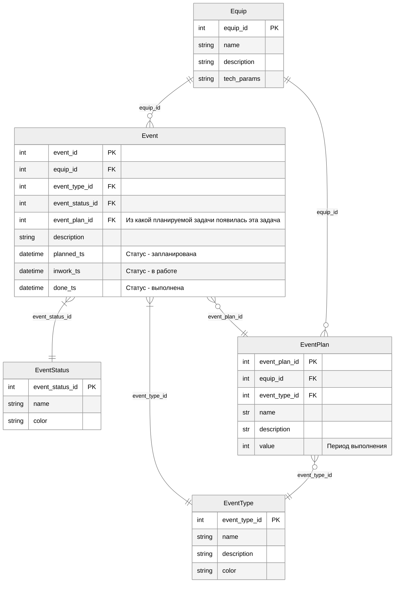

# Структура БД

```mermaid
%%{init: {'theme':'neutral'}}%%
erDiagram
 	Equip ||--o{ Event : equip_id
 	Event }|--|| EventType : event_type_id
 	Event }|--|| EventStatus : event_status_id
 	EventPlan }o--|| Equip : equip_id
 	EventPlan }o--|| EventType : event_type_id
 	Event }o--|| EventPlan : event_plan_id
 	
    Equip {
        int equip_id PK
        string name
        string description
        string tech_params
    }
    
    %% Плановые / внеплановые работы
    EventType {
    	int event_type_id PK
    	string name
    	string description
    	string color
    }
    
    %% План / в работе / выполнено
    EventStatus {
    	int event_status_id PK
    	string name
    	string color
    }
    
    %% Планируемые работы, составление расписания
    EventPlan {
    	int event_plan_id PK
    	int equip_id FK
    	int event_type_id FK
    	str name
    	str description
    	int value "Период выполнения"
    }
    
    %% Факт. работы
    Event {
    	int event_id PK
    	int equip_id FK
    	int event_type_id FK
    	int event_status_id FK
    	int event_plan_id FK "Из какой планируемой задачи появилась эта задача"
    	string description
    	datetime planned_ts "Статус - запланирована"
    	datetime inwork_ts "Статус - в работе"
    	datetime done_ts "Статус - выполнена"
    }
    
```

