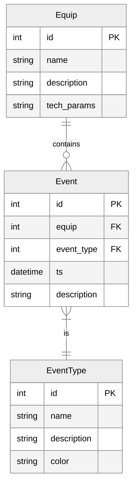

# Структура БД

```mermaid
%%{init: {'theme':'neutral'}}%%
erDiagram
 	Equip ||--o{ Event : contains
 	Event }|--|| EventType : is
    Equip {
        int id PK
        string name
        string description
        string tech_params
    }
    Event {
    	int id PK
    	int equip FK
    	int event_type FK
    	datetime ts
    	string description
    }
    EventType {
    	int id PK
    	string name
    	string description
    	string color
    }
```

